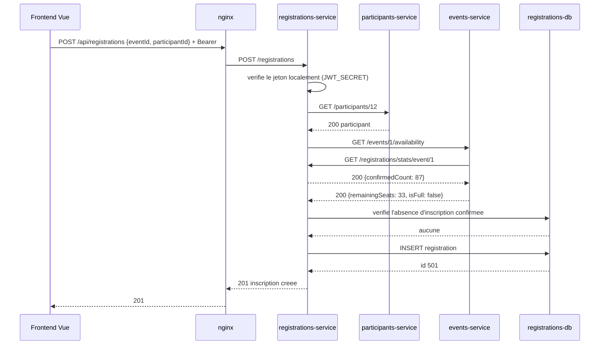
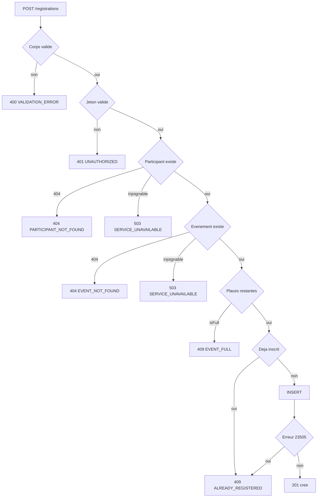

# Flux d'inscription à un événement

Scénario le plus complexe du système : il mobilise trois services et une base.

## Cas nominal



Noter la boucle : `events-service` interroge `registrations-service` pour compter les
inscrits, alors que `registrations-service` interroge `events-service` pour connaître
la capacité. Ce n'est pas une dépendance circulaire bloquante car les deux points
d'entrée concernés sont différents et sans état, mais cela impose un timeout strict
de 3 secondes pour éviter tout blocage mutuel.

## Cas d'erreur



## Principe directeur

En cas de doute, refuser. Si `participants-service` ou `events-service` est
injoignable, le service renvoie `503` et n'inscrit personne. Une inscription refusée
à tort se retente en un clic. Un surbooking se répare difficilement le jour de
l'événement.

## Garde-fou en base

```sql
CREATE UNIQUE INDEX idx_registrations_unique_active
  ON registrations (event_id, participant_id)
  WHERE status = 'confirmee';
```

Deux requêtes concurrentes peuvent toutes deux passer la vérification applicative.
Seule cette contrainte de base tranche. Le service attrape le code d'erreur
PostgreSQL `23505` et renvoie `409 ALREADY_REGISTERED`.

Cet index ne protège pas contre le dépassement de capacité par deux personnes
différentes sur la dernière place. Ce risque résiduel est enregistré sous R-06 et
documenté dans le rapport comme amélioration possible.
