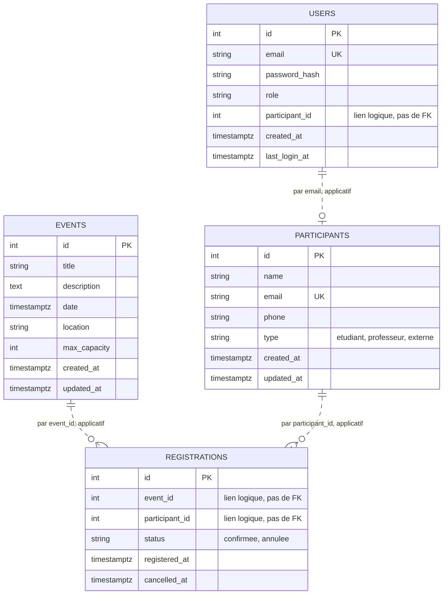

# Modèles de données

Quatre bases PostgreSQL 16 indépendantes. **Aucune clé étrangère ne traverse une
frontière de service**, conformément à l'ADR 0003.

## Vue d'ensemble



Les traits pointillés signalent des relations **logiques**, maintenues par le code
et non par le moteur de base.

## Schémas SQL

### auth-db, base `auth`

```sql
CREATE TABLE users (
  id             SERIAL PRIMARY KEY,
  email          VARCHAR(150) NOT NULL UNIQUE,
  password_hash  VARCHAR(255) NOT NULL,
  role           VARCHAR(20)  NOT NULL CHECK (role IN ('organisateur','participant')),
  participant_id INTEGER,
  created_at     TIMESTAMPTZ  NOT NULL DEFAULT NOW(),
  last_login_at  TIMESTAMPTZ
);
```

### participants-db, base `participants`

```sql
CREATE TABLE participants (
  id         SERIAL PRIMARY KEY,
  name       VARCHAR(150) NOT NULL,
  email      VARCHAR(150) NOT NULL UNIQUE,
  phone      VARCHAR(30),
  type       VARCHAR(20)  NOT NULL CHECK (type IN ('etudiant','professeur','externe')),
  created_at TIMESTAMPTZ  NOT NULL DEFAULT NOW(),
  updated_at TIMESTAMPTZ  NOT NULL DEFAULT NOW()
);

CREATE INDEX idx_participants_name ON participants (LOWER(name));
```

### events-db, base `events`

```sql
CREATE TABLE events (
  id           SERIAL PRIMARY KEY,
  title        VARCHAR(200) NOT NULL,
  description  TEXT,
  date         TIMESTAMPTZ  NOT NULL,
  location     VARCHAR(200) NOT NULL,
  max_capacity INTEGER      NOT NULL CHECK (max_capacity > 0),
  created_at   TIMESTAMPTZ  NOT NULL DEFAULT NOW(),
  updated_at   TIMESTAMPTZ  NOT NULL DEFAULT NOW()
);

CREATE INDEX idx_events_date     ON events (date);
CREATE INDEX idx_events_location ON events (LOWER(location));
```

Les deux index correspondent exactement aux deux filtres exigés par le sujet.

### registrations-db, base `registrations`

```sql
CREATE TABLE registrations (
  id             SERIAL PRIMARY KEY,
  event_id       INTEGER     NOT NULL,
  participant_id INTEGER     NOT NULL,
  status         VARCHAR(20) NOT NULL DEFAULT 'confirmee'
                 CHECK (status IN ('confirmee','annulee')),
  registered_at  TIMESTAMPTZ NOT NULL DEFAULT NOW(),
  cancelled_at   TIMESTAMPTZ
);

CREATE UNIQUE INDEX idx_registrations_unique_active
  ON registrations (event_id, participant_id)
  WHERE status = 'confirmee';

CREATE INDEX idx_registrations_event       ON registrations (event_id);
CREATE INDEX idx_registrations_participant ON registrations (participant_id);
```

## Conventions

| Règle | Application |
|---|---|
| Nommage en base | `snake_case` |
| Nommage dans l'API | `camelCase`, conversion dans la couche de mapping |
| Horodatage | `TIMESTAMPTZ`, toujours en UTC |
| Suppression d'inscription | logique, `status = 'annulee'`, jamais de `DELETE` |
| Suppression d'événement ou de participant | physique |
| Énumérations | contrainte `CHECK` en base, pas seulement dans le code |
