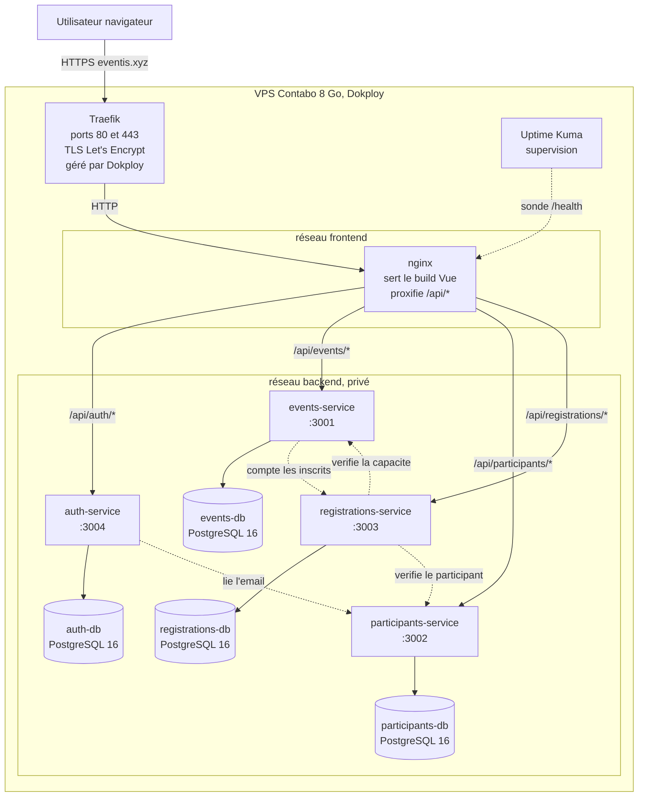
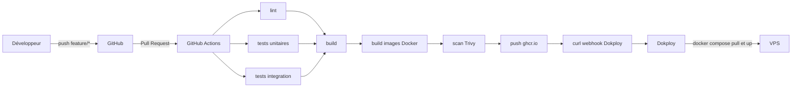

# Architecture générale, EventHub

## Diagramme de déploiement

Traits pleins : chemin d'une requête utilisateur.
Traits pointillés : appels entre services, internes au réseau `backend`.

## Chaîne CI/CD

Le déploiement ne se déclenche que sur la branche `main`. Sur `develop` et sur les
branches `feature/*`, le pipeline s'arrête après le build.

## Ports

| Composant | Port interne | Publié sur l'hôte |
|---|---|---|
| nginx | 80 | oui, exposé à Traefik |
| events-service | 3001 | non |
| participants-service | 3002 | non |
| registrations-service | 3003 | non |
| auth-service | 3004 | non |
| events-db | 5432 | non |
| participants-db | 5432 | non |
| registrations-db | 5432 | non |
| auth-db | 5432 | non |
| uptime-kuma | 3001 | non, accès via Dokploy |

Un seul port est publié. C'est un argument de sécurité à faire figurer dans le
rapport.

## Correspondance des chemins

| URL publique | Service cible | Chemin interne |
|---|---|---|
| `https://eventis.xyz/` | nginx | build Vue statique |
| `https://eventis.xyz/api/auth/login` | auth-service:3004 | `/auth/login` |
| `https://eventis.xyz/api/events` | events-service:3001 | `/events` |
| `https://eventis.xyz/api/participants` | participants-service:3002 | `/participants` |
| `https://eventis.xyz/api/registrations` | registrations-service:3003 | `/registrations` |
| `https://eventis.xyz/api/events/docs` | events-service:3001 | `/docs`, Swagger UI |
